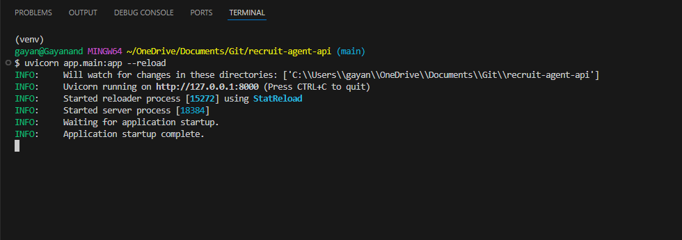
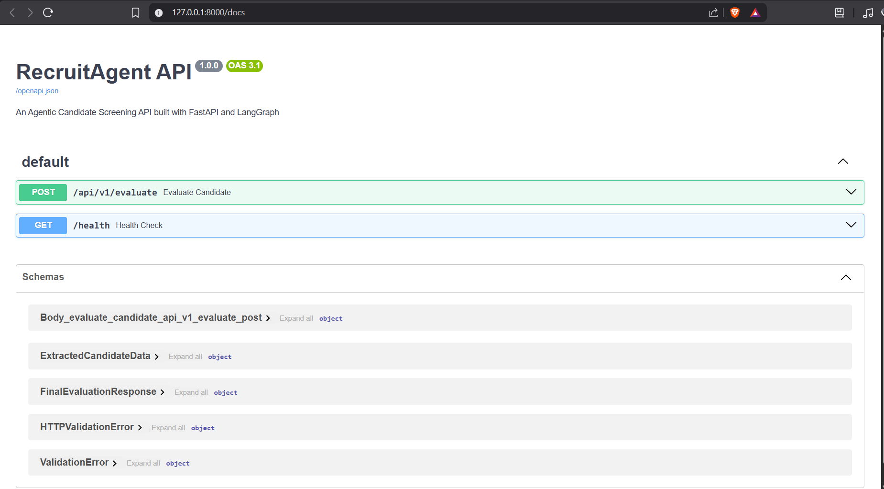

# 🕵️‍♂️ RecruitAgent API: Agentic Candidate Screening Pipeline


RecruitAgent is an Agentic AI screening API built with FastAPI and LangGraph, designed to simulate an intelligent recruitment SaaS feature. It automates the resume screening process by extracting data from raw documents (PDF, DOCX, TXT) and evaluating it against a job description using a self-correcting AI workflow.

---

## 📸 System Screenshots

| Launch FastAPI Server | Swagger UI Homepage | Enable Testing |
| :---: | :---: | :---: |
|  |  | screenshots/enable_testing.gif |
| *FastAPI Swagger UI handling multipart/form-data for Resumes and Job Descriptions.* | *The final deterministic JSON output from the Critic Agent.* | *Enbling Testing to upload sample data* |

---

## 📋 Overview

Traditional single-prompt LLM chains suffer from hallucination, so this project implements an "Evaluator-Critic" loop using LangGraph to ensure higher reliability in candidate scoring. 

Instead of relying on a single zero-shot evaluation, the system utilizes specialized AI agents to extract structured data, score the candidate objectively, and self-critique the results to eliminate bias before returning a deterministic JSON response to the client.

## ⛩️ Architecture & Flow (The Agentic Graph)

This project utilizes a stateful graph architecture to manage the LLM reasoning process:

1. **Extraction Node:** Takes a raw document resume and uses an LLM purely to extract structured data (Skills, Experience Years, Education) into a strict Pydantic model.
2. **Evaluation Node:** Takes the extracted structured data and the Job Description document. It outputs a base score and identifies skill gaps.
3. **Critic Node (Self-Reflection):** Reviews the Evaluator's score. If the Critic finds the score is biased or missed something in the context, it loops back to the Evaluator for a revision.
4. **FastAPI Layer:** Handles asynchronous `multipart/form-data` file uploads, parses the documents into text, and serves the final structured JSON output.

## 💻 Tech Stack

* **Language:** Python 3.11/3.12
* **Web Framework:** FastAPI (essential for modern Python backends).
* **AI Orchestration:** LangGraph (Microsoft/industry standard for building stateful, multi-actor LLM applications).
* **Data Validation:** Pydantic V2 (Enforcing strict JSON schemas for the AI outputs).
* **LLM Provider:** Azure OpenAI.
* **Document Parsing:** `pypdf`, `python-docx`

---

## 📂 Project Structure

<details>
<summary><b>Click to expand the directory tree</b></summary>

```text
recruit-agent-api/
│
├── app/
│   ├── __init__.py
│   ├── main.py                  # FastAPI application instantiation
│   ├── api/
│   │   ├── __init__.py
│   │   └── endpoints.py         # POST /api/v1/evaluate route
│   ├── agents/
│   │   ├── __init__.py
│   │   ├── state.py             # LangGraph TypedDict for state management
│   │   ├── nodes.py             # LLM functions (Extractor, Evaluator, Critic)
│   │   └── graph.py             # LangGraph compilation
│   └── core/
│       ├── __init__.py
│       ├── config.py            # Pydantic BaseSettings for env vars
│       ├── parsers.py           # Document extraction logic (PDF, DOCX, TXT)
│       └── schemas.py           # Pydantic models for strict LLM outputs
│
│
├── data/
│   ├── resume/                  # Sample files for local testing
|   |   |__sampleresume.pdf
|   |__ job description/
|   |   |__samplejd.pdf
│   ├── sample_resume.txt
│   └── sample_job_description.txt      
│
├── .env                 # Template for required API keys
├── .gitignore
├── requirements.txt
└── README.md                    # Project documentation
```
</details>

## 🕮 Quickstart Guide
1. Prerequisites
Ensure you have Python 3.11 or 3.12 installed on your machine.

2. Installation
Clone the repository and install the required dependencies:
```bash
git clone <your-repo-url>
cd recruit-agent-api

# Create and activate a virtual environment
python -m venv venv
source venv/bin/activate  # On Windows: venv\Scripts\activate

# Install dependencies
pip install -r requirements.txt
```
3. Environment Configuration

This project is configured to use Azure OpenAI's API. Create a .env file in the root directory:
```bash
cp .env
```

Populate .env with your Azure credentials:
```bash
AZURE_OPENAI_API_KEY=your_azure_api_key_here
AZURE_OPENAI_ENDPOINT=[https://your-resource-name.openai.azure.com/](https://your-resource-name.openai.azure.com/)
AZURE_OPENAI_API_VERSION=2024-08-01-preview
AZURE_OPENAI_DEPLOYMENT_NAME=your_model_deployment_name
```
4. Running the Application

Launch the asynchronous FastAPI server:
```bash
uvicorn app.main:app --reload
```

## 🧪 How to Test the API (Step-by-Step)
Once your server is running, FastAPI automatically generates an interactive documentation interface (Swagger UI) that allows you to test the file uploads directly from your browser.

1. **Open the Interactive UI:** Open your web browser and navigate to http://127.0.0.1:8000/docs.

2. **Locate the Endpoint:** Find the green `POST` box labeled `/api/v1/evaluate` and click on it to expand the details.

3. **Enable Testing:** Click the **"Try it out"** button in the top right corner of the expanded box.

4. **Upload Documents:**  
- Under the `resume` field, click **"Choose File"** and select a test candidate resume (e.g., `data/sample_resume_1.pdf`).

- Under the `job_description` field, click **"Choose File"** and select the target job description (e.g., `data/job_description.txt`).

5. **Run the Agents:** Click the large blue **"Execute"** button. This will trigger the backend workflow (Extractor -> Evaluator -> Critic).

6. **View the Results:** Scroll down slightly to the **"Responses"** section. Under the "Server response" block, you will see a `200` status code and the final JSON evaluation.

### Example Successful Output:
```bash
{
  "candidate_data": {
    "skills": ["Python", "FastAPI", "Docker"],
    "experience_years": 3,
    "education": "B.S. in Computer Science"
  },
  "final_score": 85,
  "missing_skills": ["Azure ML", "LangGraph"],
  "evaluation_summary": "The candidate is a strong technical fit for backend development with excellent experience in FastAPI. However, they lack the specific AI orchestration experience requested."
}
```
## 📚 API Documentation
Once the server is running, access the interactive Swagger UI to test file uploads at:
```text
http://127.0.0.1:8000/docs
```
### Evaluate Candidate
```text
POST /api/v1/evaluate
```
Accepts document uploads, parses the text, and analyzes the resume against the job description.

### Request (multipart/form-data):
- `resume`: File Upload (Supported formats: `.pdf`, `.docx`, `.txt`)
- `job_description`: File Upload (Supported formats: `.pdf`, `.docx`, `.txt`)

### Successful Response (200 OK)
```bash
{
  "candidate_data": {
    "skills": ["Python", "FastAPI", "Docker"],
    "experience_years": 3,
    "education": "B.S. in Computer Science"
  },
  "final_score": 85,
  "missing_skills": ["Azure ML", "LangGraph"],
  "evaluation_summary": "The candidate is a strong technical fit for backend development with excellent experience in FastAPI. However, they lack the specific AI orchestration experience requested."
}
```